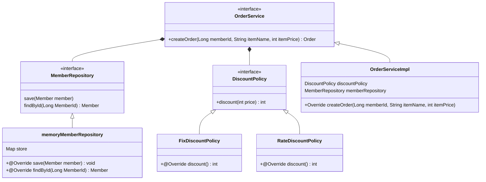

```mermaid
classDiagram
    DiscountPolicy <|-- FixDiscountPolicy
    DiscountPolicy <|-- RateDiscountPolicy
    OrderService *-- MemberRepository
    MemberRepository <|-- memoryMemberRepository
    class DiscountPolicy {
        <<interface>>
        +discount(int price) int
    }

    class FixDiscountPolicy {
        +@Override discount() int
    }
    class RateDiscountPolicy {
        +@Override discount() int
    }
    
    class MemberRepository {
        <<interface>>
        save(Member member)
        findById(Long MemberId) Member
    }
    class memoryMemberRepository {
        Map<Long, Member> store
        +@Override save(Member member) void
        +@Override findById(Long MemberId) Member
    }

    class OrderService {
        <<interface>>
        +createOrder(Long memberId, String itemName, int itemPrice) Order
    }
    class OrderServiceImpl {
        DiscountPolicy discountPolicy
        MemberRepository memberRepository
        +Override createOrder(Long memberId, String itemName, int itemPrice)
    }
    
    OrderService *-- DiscountPolicy
    OrderService <|-- OrderServiceImpl
```