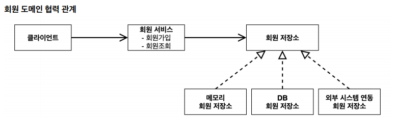
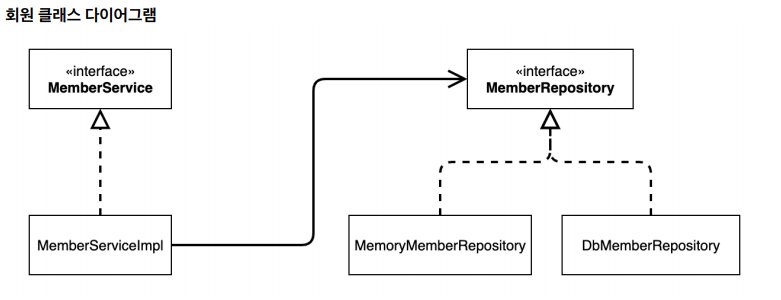
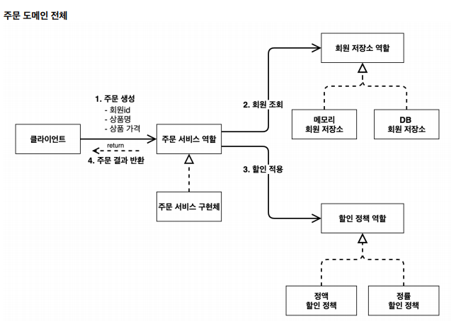
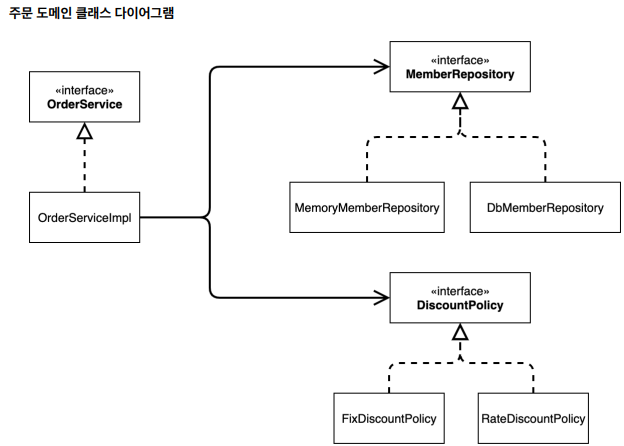

## 비즈니스 요구사항과 설계
* 회원
  * 회원을 가입하고 조회할 수 있다.
  * 회원은 일반과 VIP 두 가지 등급이 있다.
  * 회원 데이터는 자체 DB 를 구축 할 수 있고, 외부 시스템과 연동할 수 있다.
  
  * 
* 주문과 할인 정책
  * 회원은 상품을 주문할 수 있다.
  * 회원 등급에 따라 할인 정책을 적용할수 있다
  * 할인정책은 정률할인, 정액할인 2가지가 있다
  
  